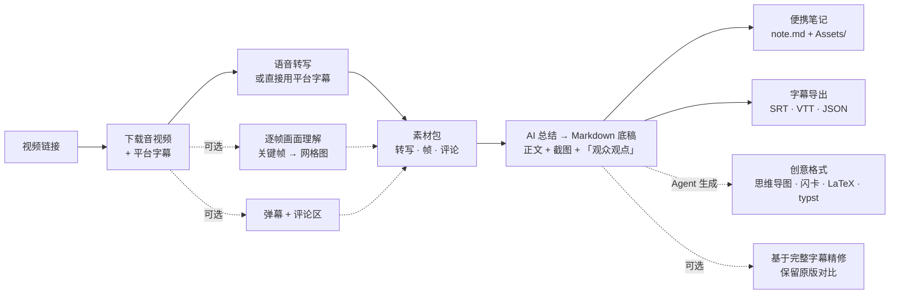
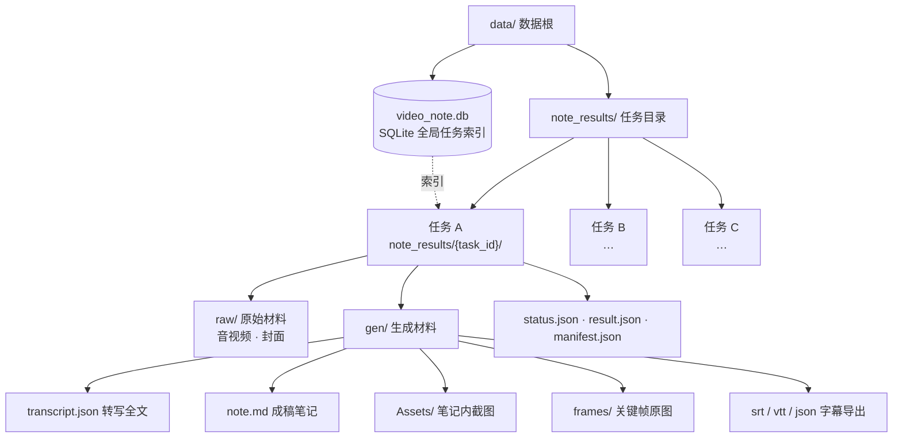

<p align="center"></p>
<h1 align="center">🎬 VideoNote-Mcp</h1>
<p align="center"><em>视频链接 → 多格式笔记</em><br/>一条链接 → 一篇笔记 · 端到端或解耦，任意组合</p>
<p align="center"><strong>🇨🇳 中文</strong> | <a href="./README_EN.md">🇬🇧 English</a></p>
<p align="center">
  <a href="#-快速开始">⚡ 快速开始</a> •
  <a href="#-文档">📚 文档</a> •
  <a href="#-真实案例">🎬 真实案例</a> •
  <a href="#-流水线地图">🗺️ 流水线地图</a> •
  <a href="#0--端到端全流程">0 端到端</a> •
  <a href="#1--下载与平台解析">1 下载</a> •
  <a href="#2--语音转写asr">2 转写</a> •
  <a href="#3--视频画面理解抽帧">3 画面</a> •
  <a href="#4--弹幕与评论">4 弹幕</a> •
  <a href="#5--ai-总结与笔记">5 总结</a> •
  <a href="#6--多格式导出">6 导出</a> •
  <a href="#7--音频增强">7 音频</a> •
  <a href="#8--任务管理与清理">8 任务</a> •
  <a href="#-最佳实践">🏆 最佳实践</a> •
  <a href="#-如何贡献">🤝 如何贡献</a> •
  <a href="#-致谢">🙏 致谢</a>
</p>


---

VideoNote-Mcp 把「视频链接 → 多格式笔记」整条流水线打包成 **MCP Server + Claude Code Skill**：给 agent 一个链接，它自动完成 下载 → 语音转写 → 画面理解 → 弹幕/评论 → AI 总结，交回一篇带截图、可整体搬迁的便携笔记。

仓库：[HuangYincan/VideoNote-MCP](https://github.com/HuangYincan/VideoNote-MCP)。

本项目**既可端到端使用（一条链接 → 一篇笔记）**，**也可解耦**：流水线每一阶段（下载 / 转写 / 抽帧 / 评论 / 总结 / 导出 / 增强 / 清理）都是独立 MCP 工具，想只用某一步、或只想了解视频内容，都能满足。无需启动任何后端服务。

<p align="center">
  <a href="https://github.com/HuangYincan/VideoNote-MCP"></a>
  <a href="LICENSE"></a>
  <a></a>
  <a></a>
  <a></a>
  <a href="https://glama.ai/mcp/servers/HuangYincan/VideoNote-MCP"></a>
</p>

---

## ⚡ 快速开始

```bash
# 1) 一条命令装好 Skill + MCP（插件 marketplace，uvx 自动更新）
claude plugin marketplace add HuangYincan/VideoNote-MCP
claude plugin install videonote@videonote

# 2) 安装时 Claude Code 会逐项提示默认值（风格/转写引擎/视频理解/评论等）；
#    装完在会话里跑配置向导收尾：
/videonote-setup

# 3) （可选）LLM-Key/B 站扫码/CLI向导
# ! videonote setup

# 4) 重启会话，对 agent 说「帮我给这个视频做笔记」+ 链接
```

> [!TIP] 
> 四种安装方式、配置细节、更新与安全见 [docs/04-使用手册.md](docs/04-使用手册.md)。

## 📚 文档

安装 / 配置 / 使用 / 环境变量 / 更新 / 安全等完整说明已归档到 `docs/`（README 只保留概览）：

- [📇 文档索引](docs/00-文档索引.md)
- [🏗️ 架构设计](docs/02-架构设计.md)
- [📖 使用手册](docs/04-使用手册.md) —— 安装（4 种方式）· 配置（setup 向导 + CLI）· 环境变量 · 更新 · 安全
- [📜 更新日志](docs/CHANGELOG.md)

---

## 🎬 真实案例

两个端到端真实案例：一个走 **AGENT 直接生成**并输出 LaTeX mathnote PDF，一个走 **全自动 LLM 生成**产出便携 Markdown。

### 案例一 · agent_direct + LaTeX mathnote（DeepSeek-V4 视频）

> 来源：[【闪客】深入解读 DeepSeek V1~V4！男女老少都听得懂～](https://www.bilibili.com/video/BV1rpovBCEGH/?vd_source=2a93b97e35c51587de18c73fcf753191)

一条视频 + 四类外部资料（论文 / 技术报告 / 公众号官宣 / 开源集合）→ **AGENT 直接生成**精修笔记，并输出 **LaTeX mathnote PDF**（中文楷体模板）：

| Page1 | Page2 | Page3 |
| :---: | :---: | :---: |
|  |  |  |

亮点：**agent_direct 全流程**（无 LLM key，Agent 读转写 + 帧图 + 评论自写笔记）· **多源交叉整合**（视频 × 论文 × 技术报告 × 开源清单）· **精修保留原稿**（`note.md` / `note_original.md` 双份）· **LaTeX mathnote PDF**（自适应修复字体缺失 / 断行溢出 / 引用去重）。完整过程记录见 [`examples/agent-direct-deepseek-v4-mathnote/README.md`](examples/agent-direct-deepseek-v4-mathnote/README.md)。

### 案例二 · 全自动 LLM 生成 + 便携 Markdown（多视频并行）

极简 Prompt（3 个 B 站链接 + 输出目录，一个参数都没说明）→ **全自动**跑完 环境检查 → 链接识别 → 供应商/模型发现 → 参数确认 → 多视频并行 → 生成后基于字幕精修，产出 3 份**精修便携笔记**（`note.md` + `Assets/` 截图 + 「观众观点」章节，并保留 `note_original.md` 供对比）。

- [雅思](https://www.bilibili.com/video/BV1c54y187SH/)：破误区 + 听/读/写/口语四科拆解 + 179 高频考点词 + 15 句逻辑框架
- [法医](https://www.bilibili.com/video/BV1QEgZ6rEGj/)：从业 43 年法医「拉片」对比影视与现实，精修扩为 12 节
- [Transformer](https://www.bilibili.com/video/BV1r8nMz4EAj/)：自注意力机制详解，18 张截图按讲课时间线分布

完整过程记录见 [`examples/note-generation-example/README.md`](examples/note-generation-example/README.md)。

---

## 🗺️ 流水线地图



| 阶段 | 职责 | 典型工具 |
|------|------|----------|
| [0 🔄 端到端全流程](#0--端到端全流程) | 一条链接 → 一篇笔记，全自动跑完整条流水线 | `generate_note` / `get_task_status` |
| [1 📥 下载与平台解析](#1--下载与平台解析) | 识别平台并下载音/视频，覆盖 1800+ 站点与本地文件 | `inspect_video` |
| [2 🎙 语音转写（ASR）](#2--语音转写asr) | 音轨转文字，本地 / 云端多引擎可选 | `generate_note` 内部完成 |
| [3 🖼️ 视频画面理解（抽帧）](#3--视频画面理解抽帧) | 按间隔抽帧，多模态 LLM「看」画面 | `video_understanding` 参数 |
| [4 💬 弹幕与评论](#4--弹幕与评论) | 抓取 B 站弹幕与评论区观点 | `include_comments` 参数 |
| [5 ✍️ AI 总结与笔记](#5--ai-总结与笔记) | 素材 → 结构化 Markdown，9 种风格可选 | `generate_note` / `prepare_note_material` |
| [6 📤 多格式导出](#6--多格式导出) | SRT/VTT/JSON 机械导出 + 创意格式（Agent 生成） | `export_transcript` |
| [7 🎛️ 音频增强](#7--音频增强) | 多文件合并、预处理、说话人分离 | `merge_audio` / `diarize_media` |
| [8 🗂️ 任务管理与清理](#8--任务管理与清理) | 全局任务索引、占用查看、按需清理 | `list_tasks` / `cleanup_note` |

---

# 0 🔄 端到端全流程

端到端模式只给一条链接即可：`generate_note` 异步跑完整条流水线并返回 `task_id`；用轻量 `get_task_status` 快照轮询到 `SUCCESS/FAILED/CANCELLED`（单进程最多 3 个进行中任务，不要在同一消息里并行提交）。`cancel_note` 协作式取消。「AGENT 直接生成」走 `prepare_note_material` —— 只准备素材包、**不调用配置 LLM**，由 agent 自己读转写、看图、写笔记。

| 工具 | 说明 | 类型 |
|------|------|------|
| `generate_note` | 一条链接 → 异步生成笔记，返回 task_id（支持视频理解 / 评论整合 / 截图便携笔记） | MCP 工具 |
| `get_task_status` | 轻量轮询任务状态（轮询到 SUCCESS/FAILED/CANCELLED） | MCP 工具 |
| `cancel_note` | 协作式取消进行中 / 排队任务 | MCP 工具 |
| `prepare_note_material` | 只准备素材包（转写 / 抽帧 / 评论），供 AGENT 直接生成 | MCP 工具 |
| AGENT 直接生成（`agent_direct`） | agent 读素材包自己写笔记，不走配置 LLM | SKILL / Agent 编排 |

# 1 📥 下载与平台解析

`inspect_video` 识别平台（bilibili / youtube / douyin / tiktok / kuaishou / local；内置 6 平台之外返回 `platform:"generic"` 自动走 **yt-dlp 通用提取**覆盖 1800+ 站点）+ 检查链接有效性（无效直接给原因）+ 把 B 站分 P / YouTube 播放列表拆成每集可独立提交的 url（不下载）。平台 Cookie 走 `! videonote login bilibili` / `! videonote setup`，**不要**经 MCP 传入。平台字幕（含 B 站 AI 字幕）由 `generate_note` 内部优先使用，无独立工具。

| 工具 | 说明 | 类型 |
|------|------|------|
| `inspect_video` | 解析分 P / 播放列表，返回每集可 `generate_note` 的 url | MCP 工具 |

# 2 🎙 语音转写（ASR）

语音转写（ASR）由 `generate_note` 内部完成：优先平台字幕（含 B 站 AI 字幕），无字幕则转写。引擎可选：`fast-whisper`（本地）/ `groq` / `bcut` / `kuaishou`（云端）/ `mlx-whisper`（macOS Apple Silicon GPU）/ `funasr`（中文最优，VAD + 自动标点）。引擎与模型管理走 CLI：`! videonote transcriber set/download`；状态查看 `get_config()`。

# 3 🖼️ 视频画面理解（抽帧）

`generate_note` 直接支持视频理解参数：`video_understanding=True` + `video_interval`（默认 6s）+ `grid_size`（默认 [3,3]），把网格图发给**多模态 LLM**「看」画面。

| 参数 | 说明 | 类型 |
|------|------|------|
| `video_understanding` / `video_interval` / `grid_size` | 按间隔抽帧 + 网格图内嵌发给多模态模型 | 参数 |

# 4 💬 弹幕与评论

`generate_note` 加 `include_comments=True` + `comments_limit`（默认 20）会把弹幕刷屏与评论区高频观点整理进笔记，新增「观众观点」章节（需 B 站 SESSDATA；抓取失败不阻断任务）。

| 参数 | 说明 | 类型 |
|------|------|------|
| `include_comments` / `comments_limit` | 笔记新增「观众观点」章节（默认 20 条） | 参数 |

# 5 ✍️ AI 总结与笔记

支持 9 种风格：`minimal` / `detailed` / `academic` / `tutorial` / `xiaohongshu` / `life_journal` / `task_oriented` / `business` / `meeting_minutes`；`format=["screenshot"]` 产出便携笔记（`note.md` + `Assets/`，相对引用可整体搬迁）。供应商/模型/转写器配置一律走 CLI（`! videonote providers set` / `! videonote transcriber set`），只读查看 `get_config()`。`agent_direct` 由 AGENT 直接生成。

| 参数 | 说明 | 类型 |
|------|------|------|
| 9 种笔记风格 + `format` | 风格选择 / screenshot 便携笔记 | 参数 |
| `get_config` | 只读配置汇总（默认值 / 供应商 / 转写器 / cookie 状态），可附加连通性探测 | MCP 工具 |
| `agent_direct` | AGENT 自己读素材包写笔记 | SKILL / Agent 编排 |

# 6 📤 多格式导出

机械格式用 `export_transcript`（srt / vtt / json）—— 确定性渲染（时间轴换算），**不耗 LLM**，返回 `file://` 路径。创意格式（思维导图 / 闪卡 / LaTeX / typst / 用户自定义模板）由 **Agent 基于 MD 底稿 + SKILL 模板**生成（LaTeX 内置 Math Note / English Article 模板：数学/理工科笔记风、英文文稿/演讲大纲风；typst 内置 zju-lab 模板：理工科笔记/实验报告/论文风、带 ZJU 校徽）。

| 工具 | 说明 | 类型 |
|------|------|------|
| `export_transcript` | 转写导出 srt/vtt/json（确定性机械格式） | MCP 工具 |
| 创意格式 | 思维导图 / 闪卡 / LaTeX / typst → Agent 基于底稿生成 | SKILL / Agent 编排 |

# 7 🎛️ 音频增强

`merge_audio` 把多段录音 / 会议分段 / 多个本地视频合并为 16kHz mono wav 再转写。音频预处理（16kHz 归一 + 超长 >1800s 自动分块，可选降噪）默认关、零硬依赖。`diarize_media` 做说话人分离（pyannote **可选重依赖**，需 HF_TOKEN + 模型授权）。

| 工具 | 说明 | 类型 |
|------|------|------|
| `merge_audio` | 多文件合并为 16kHz mono wav（FFmpeg concat） | MCP 工具 |
| 音频预处理 | 16kHz 归一 + 超长自动分块（setup ② 开启） | 配置 |
| `diarize_media` | 说话人分离（会议纪要 / 多人口播） | MCP 工具 |

# 8 🗂️ 任务管理与清理

每任务一个文件夹 `note_results/{task_id}/`：`raw/`（下载媒体）+ `gen/`（转写/笔记/帧/导出）+ 控制文件；**全局任务索引**在 SQLite `video_tasks` 表（含语义标题）。`list_tasks` 枚举全部任务（按语义标题识别）、`cleanup_note(dry_run=True)` 先查后清、`cleanup_note` / `cleanup_all` 按任务 / 全局清理（默认保留配置与模型）、`health_check` 检查 FFmpeg / 数据库 / whisper 就绪。



| 工具 | 说明 | 类型 |
|------|------|------|
| `list_tasks` | 列出全部任务（全局索引，带语义标题） | MCP 工具 |
| `cleanup_note` / `cleanup_all` | 按任务清理 / 全局清理（恢复出厂） | MCP 工具 |
| `health_check` | FFmpeg / 数据库 / whisper 就绪状态 | MCP 工具 |

---

## 🏆 最佳实践

- **学习备考**：端到端 + 视频理解 + 基于字幕的后续优化，把课程讲透。
- **会议纪要**：`merge_audio` 合并分段录音 → `diarize_media` 说话人分离 → `meeting_minutes` 风格。
- **讲座精读**：端到端生成后，agent 基于完整字幕精修、按章节补齐细节。
- **视频赏析**：开启弹幕 + 评论整合，笔记含「观众观点」章节。
- **端到端**：一条链接用 `generate_note`（下载/转写/总结/评论全流程内部完成）；只准备素材用 `prepare_note_material`。
- **真实案例**：完整案例过程记录见 [`examples`](examples)。

## 🤝 如何贡献

- 功能分支 → PR → `dev`（CI 冒烟必须绿）；`dev` 稳定后 PR → `main`（保护分支，需 review）。
- 流程、分支命名与提交前自查见 [CONTRIBUTING.md](CONTRIBUTING.md)。

## 🙏 致谢

感谢社区与所有贡献者，感谢 [Glama](https://glama.ai) 对 MCP server 的收录，以及所有开源依赖与上游流水线项目的启发。
