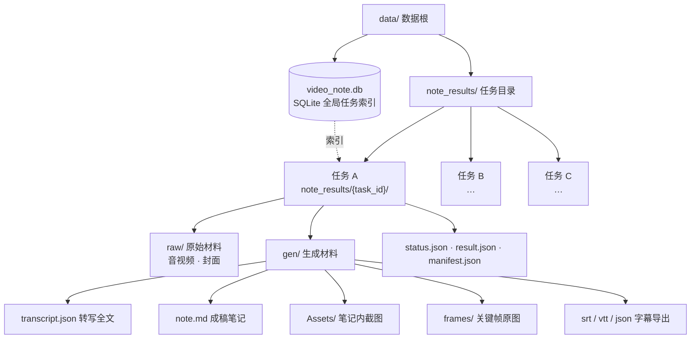

<p align="center"></p>
<h1 align="center">VideoNote-Mcp</h1>
<p align="center"><em>视频链接 → 多格式笔记</em><br/>一条链接 → 一篇笔记 · 端到端或解耦，任意组合</p>
<p align="center"><strong>中文</strong> | <a href="./README_EN.md">English</a></p>
<p align="center">
  <a href="#快速开始">快速开始</a> •
  <a href="#文档">文档</a> •
  <a href="#真实案例">真实案例</a> •
  <a href="#流水线地图">流水线地图</a> •
  <a href="#任务管理">任务管理</a> •
  <a href="#最佳实践">最佳实践</a> •
  <a href="#如何贡献">如何贡献</a>
</p>

---

VideoNote-Mcp 把「视频链接 → 多格式笔记」整条流水线打包成 **MCP Server**：给 agent 一个链接，自动完成 下载 → 语音转写 → 画面理解 → 弹幕/评论，**默认由当前对话里的 Agent 写笔记**（配置 LLM 仅当 Agent 无法看图时作为后备）。

仓库：[HuangYincan/VideoNote-MCP](https://github.com/HuangYincan/VideoNote-MCP)。

既可端到端使用（一条链接 → 一篇笔记），也可解耦：生成、素材、任务、媒体处理等工具按需取用。无需启动任何后端服务。

<p align="center">
  <a href="https://github.com/HuangYincan/VideoNote-MCP"></a>
  <a href="LICENSE"></a>
  <a></a>
  <a></a>
  <a href="https://glama.ai/mcp/servers/HuangYincan/VideoNote-MCP"></a>
</p>

---

## 快速开始

**只配置 MCP 即可，不需要安装 Skills。**

```bash
# 1) 注册独立 MCP（PyPI 已发布版本）
claude mcp add --scope user videonote -- uvx videonote@latest

# 2) 在终端配置转写 / 平台登录；默认由当前 Agent 写笔记，无需 LLM Key
uvx videonote@latest setup

# 3) 重启或重连 MCP，然后发视频链接，请 Agent 输出文字稿或笔记
```

支持 JSON 的 MCP 客户端也可使用：

```json
{
  "mcpServers": {
    "videonote": {
      "type": "stdio",
      "command": "uvx",
      "args": ["videonote@latest"]
    }
  }
}
```

> 旧版 Skills 与 `/videonote-setup` 已移除，可通过 Git 历史查阅；LaTeX/Typst 模板已独立恢复到 `videonote_mcp/templates/`，不需要恢复 Skills。已经安装的旧插件或本地 Skill 不会自动删除；若改用独立 MCP，请手动停用旧插件/Skill，避免重复加载。源码修改需客户端直接指向源码，`uvx` 不会加载未发布的本地修复。

> [!TIP]
> 四种安装方式、配置细节、更新与安全见 [docs/04-使用手册.md](docs/04-使用手册.md)。

### 使用源码中的修复（未发布到 PyPI）

`uvx videonote@latest` 运行已发布的包，不会读取本地修改。需要本仓库的抖音修复时，使用 [源码 JSON 配置](examples/mcp.source.example.json)，将 `/absolute/path/to/VideoNote-MCP` 替换为实际仓库绝对路径：

```json
{
  "mcpServers": {
    "videonote": {
      "type": "stdio",
      "command": "uv",
      "args": [
        "--directory",
        "/absolute/path/to/VideoNote-MCP",
        "run",
        "--frozen",
        "videonote"
      ]
    }
  }
}
```

在终端使用同一份源码登录，然后重连 MCP：

```bash
uv --directory /absolute/path/to/VideoNote-MCP sync --frozen
uv --directory /absolute/path/to/VideoNote-MCP run --frozen videonote login douyin
```

若设置了 `VIDEONOTE_DATA_DIR` / `VIDEONOTE_CONFIG_DIR`，CLI 与 MCP 必须使用相同值。手机确认后如有二次验证，请在打开的官方浏览器窗口内完成；附加校验未能确认不等于 Cookie 无效，不必仅因此反复扫码。详见[抖音登录排障](docs/04-使用手册.md#抖音登录扫码)。

## Agent 指引与独立导出模板

MCP 初始化说明与 `health_check` / `get_config` 会提供官方仓库、安装/排障文档入口及版本匹配提醒；失败体检项返回 `next_steps`。这些是建议，不会自动安装依赖或修改配置。MCP 尚未启动时，先按本 README 配置，再结合客户端启动日志排查。

**无需 Skills，也保留排版模板**：Math Note（LaTeX 中英文）、English Article（LaTeX）、zju-lab（Typst）随安装包分发，含原始许可证与配套文件。仍为 **10 个工具**，不需要改 MCP JSON。

```text
process_media(action="template")                                          # 列模板
process_media(action="template", template_file="GUIDE.md")                 # 离线导出指南
process_media(action="template", template_id="latex-math-note",
              template_file="main.tex")                                  # 读源码
process_media(action="template", template_id="latex-math-note",
              out_dir="<health_check.data_dir>/exports/my-note")           # 复制到新的目录
```

已有目录不覆盖；默认仅写数据目录内。也可读取 `videonote://templates` / `videonote://help/export` Resources，不支持 Resources 的客户端走以上工具即可。

- SRT/VTT/JSON：`process_media(action="export")` 确定性导出。
- LaTeX/Typst：Agent 复用已有底稿填模板；**MCP 不自动编译 PDF**。有编译器、字体及依赖且实际编译成功后才交付 PDF，否则交付完整源码。历史样例 PDF 不是用户生成的结果。
- 详见[随包导出指南](videonote_mcp/templates/README.md)。凭证只在用户终端或官方页面输入。

> 以上描述当前源码能力。已发布包可能尚未包含这些修改：先核对 `health_check.server_version` 与发布记录；需要当前代码时使用上面的源码配置，不把 `main/dev` 文档当作旧版本的功能保证。

## 文档

安装 / 配置 / 使用 / 环境变量 / 更新 / 安全等完整说明已归档到 `docs/`（README 只保留概览）：

- [文档索引](docs/00-文档索引.md)
- [架构设计](docs/02-架构设计.md) · [可编辑架构图](docs/videonote-mcp-architecture.excalidraw)
- [使用手册](docs/04-使用手册.md) —— 安装（4 种方式）· 配置（setup 向导 + CLI）· 环境变量 · 更新 · 安全
- [更新日志](docs/CHANGELOG.md)

---

## 真实案例

两个端到端真实案例：一个走 **AGENT 直接生成**并输出 LaTeX mathnote PDF，一个走 **全自动 LLM 生成**产出便携 Markdown。

### 案例一 · agent_direct + LaTeX mathnote（DeepSeek-V4 视频）

> 来源：[【闪客】深入解读 DeepSeek V1~V4！男女老少都听得懂～](https://www.bilibili.com/video/BV1rpovBCEGH/?vd_source=2a93b97e35c51587de18c73fcf753191)

一条视频 + 四类外部资料（论文 / 技术报告 / 公众号官宣 / 开源集合）→ **AGENT 直接生成**精修笔记，并输出 **LaTeX mathnote PDF**（中文楷体模板）：

| Page1 | Page2 | Page3 |
| :---: | :---: | :---: |
|  |  |  |

- 无 LLM key：Agent 读转写 + 帧图 + 评论自写笔记
- 多源交叉整合：视频 × 论文 × 技术报告 × 开源清单
- 精修保留原稿：`note.md` / `note_original.md` 双份
- LaTeX mathnote PDF：自适应修复字体缺失 / 断行溢出 / 引用去重

完整过程记录见 [`examples/agent-direct-deepseek-v4-mathnote/README.md`](examples/agent-direct-deepseek-v4-mathnote/README.md)。

### 案例二 · 全自动 LLM 生成 + 便携 Markdown（多视频并行）

极简 Prompt（3 个 B 站链接 + 输出目录，一个参数都没说明）→ **全自动**跑完 环境检查 → 链接识别 → 供应商/模型发现 → 参数确认 → 多视频并行 → 生成后基于字幕精修，产出 3 份**精修便携笔记**（`note.md` + `Assets/` 截图 + 「观众观点」章节，并保留 `note_original.md` 供对比）。

- [雅思](https://www.bilibili.com/video/BV1c54y187SH/)：破误区 + 听/读/写/口语四科拆解 + 179 高频考点词 + 15 句逻辑框架
- [法医](https://www.bilibili.com/video/BV1QEgZ6rEGj/)：从业 43 年法医「拉片」对比影视与现实，精修扩为 12 节
- [Transformer](https://www.bilibili.com/video/BV1r8nMz4EAj/)：自注意力机制详解，18 张截图按讲课时间线分布

完整过程记录见 [`examples/note-generation-example/README.md`](examples/note-generation-example/README.md)。

---

## 流水线地图


实线为主流程：一条 `prepare_note_material` 出素材，由当前对话 Agent 写笔记；`generate_note` 是后备（Agent 无法看图时走配置 LLM）。虚线为可选能力（视频理解 / 弹幕评论）。各阶段细节见 [docs/02-架构设计.md](docs/02-架构设计.md)。

## 任务管理

每任务一个文件夹 `note_results/{task_id}/`：`raw/`（下载媒体）+ `gen/`（转写/笔记/帧/导出）+ 控制文件；**全局任务索引**在 SQLite `video_tasks` 表（含语义标题）。`list_tasks` 枚举全部任务（按语义标题识别）、`cleanup(task_id, dry_run=True)` 先查后清、`cleanup` 按任务 / 全局清理（默认保留配置与模型）、`health_check` 检查 FFmpeg / 数据库 / whisper 就绪。



| 工具 | 说明 | 类型 |
|------|------|------|
| `list_tasks` | 列出全部任务（全局索引，带语义标题） | MCP 工具 |
| `cleanup` | 按任务清理（传 `task_id`）/ 全局清理（恢复出厂，不传） | MCP 工具 |
| `health_check` | FFmpeg / 数据库 / whisper 就绪状态 | MCP 工具 |

---

## 最佳实践

- **学习备考**：端到端 + 视频理解 + 基于字幕的后续优化，把课程讲透。
- **会议纪要**：`process_media(action="merge")` 合并分段录音 → `process_media(action="diarize")` 说话人分离 → `meeting_minutes` 风格。
- **讲座精读**：端到端生成后，agent 基于完整字幕精修、按章节补齐细节。
- **视频赏析**：开启弹幕 + 评论整合，笔记含「观众观点」章节。
- **默认路径**：一条链接用 `prepare_note_material`，由当前对话 Agent 写笔记；Agent 无法看图或用户要求配置 LLM 时才用 `generate_note`。只做媒体加工用 `process_media`。
- **真实案例**：完整案例过程记录见 [`examples`](examples)。

## 维护与代码导航

- **入口**：`videonote_mcp/server.py` 管 MCP 协议、权限与任务生命周期；`cli.py` 管终端初始化、登录和配置。密钥只在终端/官方页面填写。
- **共享逻辑**：`task_artifacts.py` 统一读取任务状态和转写；`app/utils/local_paths.py` 统一路径规整/授权；`app/utils/media_source.py` 统一平台识别。`inspect.py` 的元信息预检和 `export/` 的确定性导出不依赖 MCP 入口、数据库或转写引擎初始化。
- **处理流水线**：`app/services/note.py` 编排任务，`pipeline.py` 提供处理步骤；模板资源与渲染代码独立，第三方来源见 [VENDOR.md](VENDOR.md)。
- **导出一致性**：CLI/MCP 优先读 `gen/transcript.json`，缓存缺失/损坏才退到 `result.json`；不改写原转写。已知失败/运行中任务不能导出；无可读状态的旧任务仍允许恢复导出，但不表示任务已成功。CLI 显式 `--out-dir` 可选任意目录，MCP 仍默认限制在数据目录内。

开发者从[接手指南](docs/00-新手上路.md)和[架构设计](docs/02-架构设计.md)开始；不需要本机私有 Skill 或个人记忆。测试隔离运行数据，协议冒烟同时检查源码和 wheel，模板原件按哈希校验。具体命令见 [CONTRIBUTING.md](CONTRIBUTING.md)。

## 如何贡献

- 长期分支仅保留 `dev`、`main`。临时功能分支 → PR → `dev`（CI 必须绿）→ PR → `main`；交付后将 `dev` 快进到 `main`，删除已合入的临时分支，保持两者最新。
- 流程、分支命名与提交前自查见 [CONTRIBUTING.md](CONTRIBUTING.md)。

## 致谢

* [Glama](https://glama.ai) ：对 MCP server 的收录
* [LINUX DO](https://linux.do/)：新的理想型社区
* 所有开源依赖与上游流水线项目的启发
