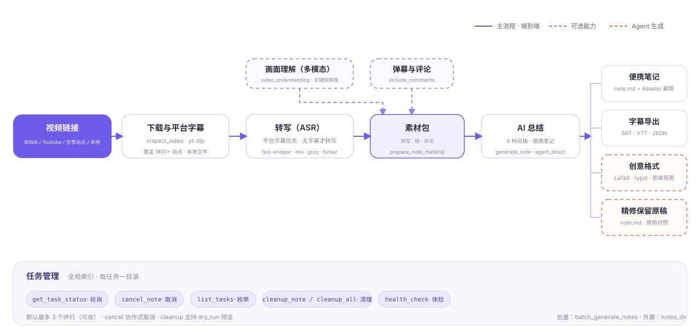
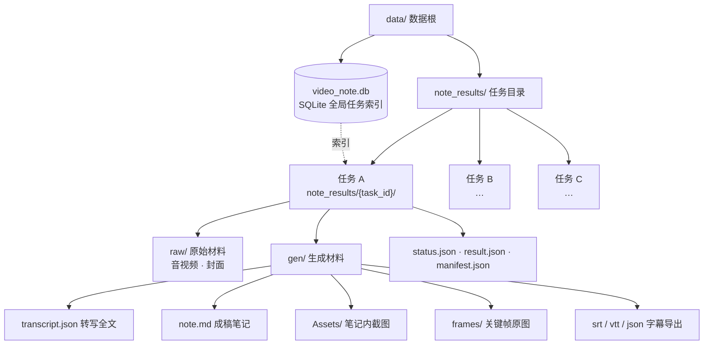

<p align="center"></p>
<h1 align="center">VideoNote-Mcp</h1>
<p align="center"><em>视频链接 → 多格式笔记</em><br/>一条链接 → 一篇笔记 · 端到端或解耦，任意组合</p>
<p align="center"><strong>中文</strong> | <a href="./README_EN.md">English</a></p>
<p align="center">
  <a href="#快速开始">快速开始</a> •
  <a href="#文档">文档</a> •
  <a href="#真实案例">真实案例</a> •
  <a href="#流水线地图">流水线地图</a> •
  <a href="#任务管理">任务管理</a> •
  <a href="#最佳实践">最佳实践</a> •
  <a href="#如何贡献">如何贡献</a>
</p>

---

VideoNote-Mcp 把「视频链接 → 多格式笔记」整条流水线打包成 **MCP Server + Claude Code Skill**：给 agent 一个链接，自动完成 下载 → 语音转写 → 画面理解 → 弹幕/评论 → AI 总结，交回一篇带截图、可整体搬迁的便携笔记。

仓库：[HuangYincan/VideoNote-MCP](https://github.com/HuangYincan/VideoNote-MCP)。

既可端到端使用（一条链接 → 一篇笔记），也可解耦：生成、素材、任务、媒体处理等工具按需取用。无需启动任何后端服务。

<p align="center">
  <a href="https://github.com/HuangYincan/VideoNote-MCP"></a>
  <a href="LICENSE"></a>
  <a></a>
  <a></a>
  <a></a>
  <a href="https://glama.ai/mcp/servers/HuangYincan/VideoNote-MCP"></a>
</p>

---

## 快速开始

```bash
# 1) 一条命令装好 Skill + MCP（插件 marketplace，uvx 自动更新）
claude plugin marketplace add HuangYincan/VideoNote-MCP
claude plugin install videonote@videonote

# 2) 安装时 Claude Code 会逐项提示默认值（风格/转写引擎/视频理解/评论等）；
#    装完在会话里跑配置向导收尾：
/videonote-setup

# 3) （可选）LLM-Key/B 站扫码/CLI向导
# ! videonote setup

# 4) 重启会话，对 agent 说「帮我给这个视频做笔记」+ 链接
```

> [!TIP]
> 四种安装方式、配置细节、更新与安全见 [docs/04-使用手册.md](docs/04-使用手册.md)。

## 文档

安装 / 配置 / 使用 / 环境变量 / 更新 / 安全等完整说明已归档到 `docs/`（README 只保留概览）：

- [文档索引](docs/00-文档索引.md)
- [架构设计](docs/02-架构设计.md)
- [使用手册](docs/04-使用手册.md) —— 安装（4 种方式）· 配置（setup 向导 + CLI）· 环境变量 · 更新 · 安全
- [更新日志](docs/CHANGELOG.md)

---

## 真实案例

两个端到端真实案例：一个走 **AGENT 直接生成**并输出 LaTeX mathnote PDF，一个走 **全自动 LLM 生成**产出便携 Markdown。

### 案例一 · agent_direct + LaTeX mathnote（DeepSeek-V4 视频）

> 来源：[【闪客】深入解读 DeepSeek V1~V4！男女老少都听得懂～](https://www.bilibili.com/video/BV1rpovBCEGH/?vd_source=2a93b97e35c51587de18c73fcf753191)

一条视频 + 四类外部资料（论文 / 技术报告 / 公众号官宣 / 开源集合）→ **AGENT 直接生成**精修笔记，并输出 **LaTeX mathnote PDF**（中文楷体模板）：

| Page1 | Page2 | Page3 |
| :---: | :---: | :---: |
|  |  |  |

- 无 LLM key：Agent 读转写 + 帧图 + 评论自写笔记
- 多源交叉整合：视频 × 论文 × 技术报告 × 开源清单
- 精修保留原稿：`note.md` / `note_original.md` 双份
- LaTeX mathnote PDF：自适应修复字体缺失 / 断行溢出 / 引用去重

完整过程记录见 [`examples/agent-direct-deepseek-v4-mathnote/README.md`](examples/agent-direct-deepseek-v4-mathnote/README.md)。

### 案例二 · 全自动 LLM 生成 + 便携 Markdown（多视频并行）

极简 Prompt（3 个 B 站链接 + 输出目录，一个参数都没说明）→ **全自动**跑完 环境检查 → 链接识别 → 供应商/模型发现 → 参数确认 → 多视频并行 → 生成后基于字幕精修，产出 3 份**精修便携笔记**（`note.md` + `Assets/` 截图 + 「观众观点」章节，并保留 `note_original.md` 供对比）。

- [雅思](https://www.bilibili.com/video/BV1c54y187SH/)：破误区 + 听/读/写/口语四科拆解 + 179 高频考点词 + 15 句逻辑框架
- [法医](https://www.bilibili.com/video/BV1QEgZ6rEGj/)：从业 43 年法医「拉片」对比影视与现实，精修扩为 12 节
- [Transformer](https://www.bilibili.com/video/BV1r8nMz4EAj/)：自注意力机制详解，18 张截图按讲课时间线分布

完整过程记录见 [`examples/note-generation-example/README.md`](examples/note-generation-example/README.md)。

---

## 流水线地图



实线为主流程：一条 `generate_note` 链接端到端跑通；虚线为可选能力（视频理解 / 弹幕评论 / Agent 生成），按需取用。各阶段细节（平台支持、引擎、参数）见 [docs/02-架构设计.md](docs/02-架构设计.md)。

## 任务管理

每任务一个文件夹 `note_results/{task_id}/`：`raw/`（下载媒体）+ `gen/`（转写/笔记/帧/导出）+ 控制文件；**全局任务索引**在 SQLite `video_tasks` 表（含语义标题）。`list_tasks` 枚举全部任务（按语义标题识别）、`cleanup(task_id, dry_run=True)` 先查后清、`cleanup` 按任务 / 全局清理（默认保留配置与模型）、`health_check` 检查 FFmpeg / 数据库 / whisper 就绪。



| 工具 | 说明 | 类型 |
|------|------|------|
| `list_tasks` | 列出全部任务（全局索引，带语义标题） | MCP 工具 |
| `cleanup` | 按任务清理（传 `task_id`）/ 全局清理（恢复出厂，不传） | MCP 工具 |
| `health_check` | FFmpeg / 数据库 / whisper 就绪状态 | MCP 工具 |

---

## 最佳实践

- **学习备考**：端到端 + 视频理解 + 基于字幕的后续优化，把课程讲透。
- **会议纪要**：`process_media(action="merge")` 合并分段录音 → `process_media(action="diarize")` 说话人分离 → `meeting_minutes` 风格。
- **讲座精读**：端到端生成后，agent 基于完整字幕精修、按章节补齐细节。
- **视频赏析**：开启弹幕 + 评论整合，笔记含「观众观点」章节。
- **端到端**：一条链接用 `generate_note`（下载/转写/总结/评论全流程内部完成）；只准备素材用 `prepare_note_material`。
- **真实案例**：完整案例过程记录见 [`examples`](examples)。

## 如何贡献

- 功能分支 → PR → `dev`（CI 冒烟必须绿）；`dev` 稳定后 PR → `main`（保护分支，需 review）。
- 流程、分支命名与提交前自查见 [CONTRIBUTING.md](CONTRIBUTING.md)。

## 致谢

感谢社区与所有贡献者，感谢 [Glama](https://glama.ai) 对 MCP server 的收录，以及所有开源依赖与上游流水线项目的启发。
