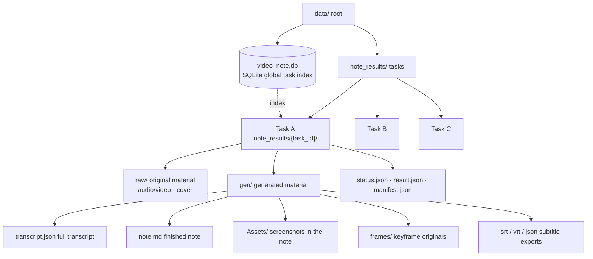

<p align="center"></p>
<h1 align="center">VideoNote-Mcp</h1>
<p align="center"><em>Video link → multi-format notes</em><br/>One link → one note · end-to-end or decoupled, any combination</p>
<p align="center"><a href="./README.md">中文</a> | <strong>English</strong></p>
<p align="center">
  <a href="#quick-start">Quick Start</a> •
  <a href="#docs">Docs</a> •
  <a href="#real-world-examples">Real-world Examples</a> •
  <a href="#pipeline-map">Pipeline Map</a> •
  <a href="#task-management">Task Management</a> •
  <a href="#best-practices">Best Practices</a> •
  <a href="#how-to-contribute">Contribute</a>
</p>

---

VideoNote-Mcp packages the whole "video link → multi-format notes" pipeline into an **MCP Server**: hand an agent a link and it automatically runs download → transcription → frame understanding → danmaku/comments. **By default the current conversation agent writes the note**; the configured LLM is only a fallback when the agent cannot see images.

Repository: [HuangYincan/VideoNote-MCP](https://github.com/HuangYincan/VideoNote-MCP).

It works **end-to-end (one link → one note)** and is **also decoupled**: pick and choose among generation, material, task and media-processing tools. No backend required.

<p align="center">
  <a href="https://github.com/HuangYincan/VideoNote-MCP"></a>
  <a href="LICENSE"></a>
  <a></a>
  <a></a>
  <a href="https://glama.ai/mcp/servers/HuangYincan/VideoNote-MCP"></a>
</p>

---

## Quick Start

**Configure the MCP server directly; no Skills required.**

```bash
# 1) Register the standalone MCP server (published PyPI version)
claude mcp add --scope user videonote -- uvx videonote@latest

# 2) Configure transcription / platform login in your terminal
#    The default agent-written note workflow needs no LLM API key
uvx videonote@latest setup

# 3) Restart or reconnect MCP, then give your agent a video link
```

For JSON-based MCP clients:

```json
{
  "mcpServers": {
    "videonote": {
      "type": "stdio",
      "command": "uvx",
      "args": ["videonote@latest"]
    }
  }
}
```

> Legacy Skills and `/videonote-setup` have been removed and remain available in Git history. LaTeX/Typst templates have been restored independently under `videonote_mcp/templates/`; restoring Skills is not required. Previously installed plugins or local Skills are not automatically removed; disable the old integration when switching to standalone MCP to avoid duplicate loading. Point your client at a source checkout to test unpublished fixes: `uvx` does not load local changes.

> All four install methods, configuration details, updating and security are in [docs/04-使用手册.md](docs/04-使用手册.md).

### Run fixes from a source checkout (not yet on PyPI)

`uvx videonote@latest` runs a published package, not local changes. To use the Douyin fixes in this repository, use the [source JSON configuration](examples/mcp.source.example.json) and replace `/absolute/path/to/VideoNote-MCP` with the checkout's absolute path:

```json
{
  "mcpServers": {
    "videonote": {
      "type": "stdio",
      "command": "uv",
      "args": [
        "--directory",
        "/absolute/path/to/VideoNote-MCP",
        "run",
        "--frozen",
        "videonote"
      ]
    }
  }
}
```

Log in with the same checkout, then reconnect the MCP server:

```bash
uv --directory /absolute/path/to/VideoNote-MCP sync --frozen
uv --directory /absolute/path/to/VideoNote-MCP run --frozen videonote login douyin
```

If you set `VIDEONOTE_DATA_DIR` / `VIDEONOTE_CONFIG_DIR`, use identical values for the CLI and MCP server. Complete any secondary verification in the official browser window. An inconclusive follow-up check does not mean the saved Cookie is invalid; it alone is not a reason to scan again. See [Douyin troubleshooting (Chinese)](docs/04-使用手册.md#抖音登录扫码).

## Agent guidance and standalone export templates

Initialization instructions and `health_check` / `get_config` expose the official repository, installation/troubleshooting docs, and version-matching advice. Failed health checks include `next_steps`; they do not install dependencies or change configuration. If the MCP server cannot start, use this README and the client's startup logs first.

**No Skills required; templates are included:** Math Note (English/Chinese LaTeX), English Article (LaTeX), and zju-lab (Typst), with their original licenses and companion files. There are still **10 tools**, and your MCP JSON does not need to change.

```text
process_media(action="template")                                          # list templates
process_media(action="template", template_file="GUIDE.md")                 # offline guide
process_media(action="template", template_id="latex-math-note",
              template_file="main.tex")                                  # read source
process_media(action="template", template_id="latex-math-note",
              out_dir="<health_check.data_dir>/exports/my-note")           # copy to a NEW directory
```

Existing directories are never overwritten; writes are restricted to the data directory by default. Resources `videonote://templates` and `videonote://help/export` are also available, with the tool calls above as a fallback for clients without resource support.

- SRT/VTT/JSON: deterministic export with `process_media(action="export")`.
- LaTeX/Typst: the agent adapts the template using the existing note/transcript. **MCP does not automatically compile PDF.** Deliver a PDF only after successful compilation with the required compiler, fonts and packages; otherwise deliver complete source files. Bundled sample PDFs are not user-generated outputs.
- See the [bundled export guide](videonote_mcp/templates/README.md). Credentials stay in the user's terminal or the platform's official page.

> This describes the current source tree. Published packages may not include these changes yet: check `health_check.server_version` against release notes. Use the source configuration above for this implementation; do not assume `main/dev` docs apply to an older release.

## Docs

Full installation / configuration / usage / env vars / updating / security docs now live in `docs/` (this README keeps just the overview):

- [Document Index](docs/00-文档索引.md)
- [Architecture](docs/02-架构设计.md)
- [User Manual](docs/04-使用手册.md) — install (4 methods) · config (setup wizard + CLI) · env vars · updating · security
- [Changelog](docs/CHANGELOG.md)
- [Editable architecture diagram](docs/videonote-mcp-architecture.excalidraw)

---

## Real-world Examples

Two end-to-end examples: one runs **AGENT direct generation** and outputs a **LaTeX mathnote PDF**; the other runs **fully automatic LLM generation** and produces portable Markdown.

### Example 1 · agent_direct + LaTeX mathnote (DeepSeek-V4 video)

> Source: [【闪客】深入解读 DeepSeek V1~V4！男女老少都听得懂～](https://www.bilibili.com/video/BV1rpovBCEGH/?vd_source=2a93b97e35c51587de18c73fcf753191)

One video + four kinds of external sources (paper / tech report / WeChat announcement / open-source collections) → **AGENT direct generation** of a refined note, output as a **LaTeX mathnote PDF** (Chinese KaiTi template):

| Page1 | Page2 | Page3 |
| :---: | :---: | :---: |
|  |  |  |

- No LLM key: the Agent writes the note from transcript + frames + comments
- Multi-source cross-integration: video × paper × tech report × open-source list
- Refined copy keeps the original: `note.md` / `note_original.md` pair
- LaTeX mathnote PDF: auto-fixes missing fonts / line-overflow / citation dedup

Full run record: [`examples/agent-direct-deepseek-v4-mathnote/README.md`](examples/agent-direct-deepseek-v4-mathnote/README.md).

### Example 2 · Fully automatic LLM generation + portable Markdown (multi-video parallel)

A minimal prompt (3 Bilibili links + an output dir, not a single parameter given) → **fully automatic** run of env check → link detection → provider/model discovery → parameter confirmation → multi-video parallel → post-generation refinement from the transcript, producing 3 **portable refined notes** (`note.md` + `Assets/` screenshots + a "Viewer Opinions" section, keeping `note_original.md` for comparison).

- [**IELTS**](https://www.bilibili.com/video/BV1c54y187SH/): myth-busting + listening/reading/writing/speaking breakdown + 179 high-frequency exam words + 15-sentence logic framework
- [**Forensics**](https://www.bilibili.com/video/BV1QEgZ6rEGj/): a 43-year forensic pathologist "reacts" to film vs. reality; refined into 12 sections
- [**Transformer**](https://www.bilibili.com/video/BV1r8nMz4EAj/): self-attention deep dive, 18 screenshots distributed along the lecture timeline

Full run record: [`examples/note-generation-example/README.md`](examples/note-generation-example/README.md).

---

## Pipeline Map


Solid lines are the main flow: `prepare_note_material` produces the pack, and the current conversation agent writes the note. `generate_note` is the fallback (configured LLM when the agent cannot see images). Dashed lines are optional capabilities (video understanding / danmaku + comments). Stage details live in [docs/02-架构设计.md](docs/02-架构设计.md).

## Task Management

One folder per task `note_results/{task_id}/`: `raw/` (downloaded media) + `gen/` (transcript/note/frames/exports) + control files; a **global task index** lives in the SQLite `video_tasks` table (with semantic titles). `list_tasks` enumerates all tasks (identify by semantic title), `cleanup(task_id, dry_run=True)` inspects a task before cleanup, `cleanup` does per-task / global cleanup (config & models kept by default), and `health_check` verifies FFmpeg / database / whisper readiness.



| Tool | Description | Type |
|------|------|------|
| `list_tasks` | List all tasks (global index, with semantic titles) | MCP tool |
| `cleanup` | Per-task cleanup (with `task_id`) / global cleanup (factory reset, without) | MCP tool |
| `health_check` | FFmpeg / database / whisper readiness | MCP tool |

---

## Best Practices

- **Study & exam prep**: end-to-end + video understanding + transcript-based follow-up refinement.
- **Meeting minutes**: `process_media(action="merge")` to join recorded segments → `process_media(action="diarize")` for speakers → `meeting_minutes` style.
- **Deep-reading a lecture**: after end-to-end generation, the agent refines from the full transcript, filling in section by section.
- **Video appreciation**: enable danmaku + comment integration for an "Audience viewpoints" section.
- **Default path**: one link uses `prepare_note_material`, and the current conversation agent writes the note; use `generate_note` only when the agent cannot see images or the user asks for the configured LLM. Use `process_media` for media operations (merge / diarize / export).
- **Real example**: full run records for both cases live in [`examples`](examples).

## Maintenance and code navigation

- **Entry points:** `videonote_mcp/server.py` owns MCP transport, permissions and task lifecycle; `cli.py` owns terminal setup, login and configuration. Credentials stay in the terminal or official login page.
- **Shared logic:** `task_artifacts.py` reads task status/transcripts; `app/utils/local_paths.py` normalizes paths and enforces access policy; `app/utils/media_source.py` detects platforms. Metadata inspection in `inspect.py` and deterministic `export/` do not require MCP, database or transcription-engine initialization.
- **Processing pipeline:** `app/services/note.py` orchestrates tasks and `pipeline.py` provides processing steps. Template resources stay separate from rendering code; see [VENDOR.md](VENDOR.md) for third-party provenance.
- **Consistent exports:** CLI/MCP prefer `gen/transcript.json`, falling back to `result.json` when the cache is missing or unusable, without overwriting the original transcript. Known failed/running tasks cannot be exported. Legacy tasks with unreadable/missing status can still be recovered by export, but this does not mark them successful. Explicit CLI `--out-dir` allows arbitrary destinations; MCP remains data-directory-restricted by default.

Start with the [handoff guide](docs/00-新手上路.md) and [architecture](docs/02-架构设计.md). No private local Skill or personal memory is required. Tests isolate runtime data, protocol smoke tests cover both source and wheel, and original template bytes are hash-checked. Commands are in [CONTRIBUTING.md](CONTRIBUTING.md).

## How to Contribute

- Keep only `dev` and `main` as permanent branches. Temporary feature branch → PR → `dev` (CI must pass) → PR → `main`. After delivery, fast-forward `dev` to `main` and remove merged temporary branches so both remain current.
- Workflow, branch naming and pre-commit self-checks are in [CONTRIBUTING.md](CONTRIBUTING.md).

## Acknowledgements

Thanks to the community and all contributors, to [Glama](https://glama.ai) for listing this MCP server, and to all open-source dependencies and the upstream pipeline project that inspired this work.
