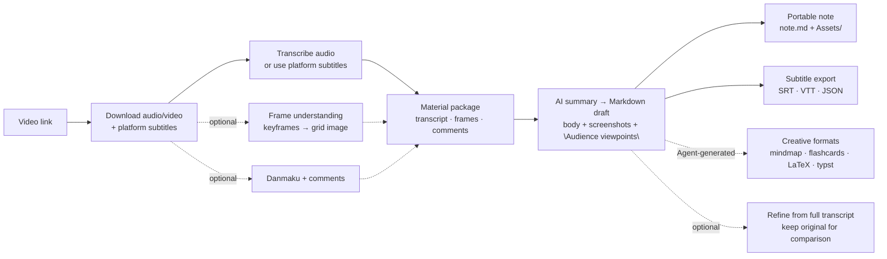
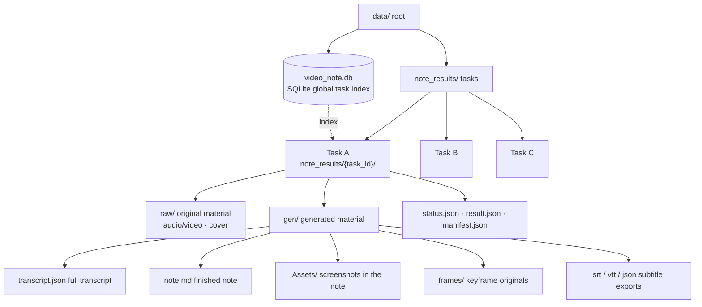

<p align="center"></p>
<h1 align="center">🎬 VideoNote-Mcp</h1>
<p align="center"><em>Video link → multi-format notes</em><br/>One link → one note · end-to-end or decoupled, any combination</p>
<p align="center"><a href="./README.md">🇨🇳 中文</a> | <strong>🇬🇧 English</strong></p>
<p align="center">
  <a href="#-quick-start">⚡ Quick Start</a> •
  <a href="#-docs">📚 Docs</a> •
  <a href="#-real-world-examples">🎬 Real-world Examples</a> •
  <a href="#-pipeline-map">🗺️ Pipeline Map</a> •
  <a href="#0--end-to-end-pipeline">0 End-to-end</a> •
  <a href="#1--download-and-platform-parsing">1 Download</a> •
  <a href="#2--speech-to-text-asr">2 Transcribe</a> •
  <a href="#3--frame-understanding-sampling">3 Frames</a> •
  <a href="#4--danmaku-and-comments">4 Danmaku</a> •
  <a href="#5--ai-summarization-and-notes">5 Summarize</a> •
  <a href="#6--multi-format-export">6 Export</a> •
  <a href="#7--audio-enhancement">7 Audio</a> •
  <a href="#8--task-management-and-cleanup">8 Tasks</a> •
  <a href="#-best-practices">🏆 Best Practices</a> •
  <a href="#-how-to-contribute">🤝 Contribute</a> •
  <a href="#-acknowledgements">🙏 Thanks</a>
</p>

---

VideoNote-Mcp packages the whole "video link → multi-format notes" pipeline into an **MCP Server + Claude Code Skill**: hand an agent a link and it automatically runs download → transcription → frame understanding → danmaku/comments → AI summary, returning a portable note with screenshots that you can move around.

Repository: [HuangYincan/VideoNote-MCP](https://github.com/HuangYincan/VideoNote-MCP).

This project **works end-to-end (one link → one note)** and is **also decoupled**: every pipeline stage (download / transcribe / frames / comments / summarize / export / enhance / cleanup) is an independent MCP tool, so whether you just want to use one step or simply get a sense of the video's content, either need is covered. No backend required.

<p align="center">
  <a href="https://github.com/HuangYincan/VideoNote-MCP"></a>
  <a href="LICENSE"></a>
  <a></a>
  <a></a>
  <a></a>
  <a href="https://glama.ai/mcp/servers/HuangYincan/VideoNote-MCP"></a>
</p>

---

## ⚡ Quick Start

```bash
# 1) One command installs both Skill + MCP (plugin marketplace, uvx auto-updates)
claude plugin marketplace add HuangYincan/VideoNote-MCP
claude plugin install videonote@videonote

# 2) Claude Code prompts for defaults during install (style / transcriber /
#    video-understanding / comments etc.); then run the guided config command:
/videonote-setup

# 3) (Optional) LLM key / Bilibili QR login / CLI wizard:
# ! videonote setup

# 4) Restart your session, tell the agent "make notes for this video" + link
```

> All four install methods, configuration details, updating and security are in [docs/04-使用手册.md](docs/04-使用手册.md).

## 📚 Docs

Full installation / configuration / usage / env vars / updating / security docs now live in `docs/` (this README keeps just the overview):

- [📇 Document Index](docs/00-文档索引.md)
- [🏗️ Architecture](docs/02-架构设计.md)
- [📖 User Manual](docs/04-使用手册.md) — install (4 methods) · config (setup wizard + CLI) · env vars · updating · security
- [📜 Changelog](docs/CHANGELOG.md)

---

## 🎬 Real-world Examples

Two end-to-end examples: one runs **AGENT direct generation** and outputs a **LaTeX mathnote PDF**; the other runs **fully automatic LLM generation** and produces portable Markdown.

### Example 1 · agent_direct + LaTeX mathnote (DeepSeek-V4 video)

> Source: [【闪客】深入解读 DeepSeek V1~V4！男女老少都听得懂～](https://www.bilibili.com/video/BV1rpovBCEGH/?vd_source=2a93b97e35c51587de18c73fcf753191)

One video + four kinds of external sources (paper / tech report / WeChat announcement / open-source collections) → **AGENT direct generation** of a refined note, output as a **LaTeX mathnote PDF** (Chinese KaiTi template):

| Page1 | Page2 | Page3 |
| :---: | :---: | :---: |
|  |  |  |

Highlights: **full agent_direct flow** (no LLM key — the Agent writes the note from transcript + frames + comments) · **multi-source cross-integration** (video × paper × tech report × open-source list) · **refined copy keeps the original** (`note.md` / `note_original.md` pair) · **LaTeX mathnote PDF** (auto-fixes missing fonts / line-overflow / citation dedup). Full run record: [`examples/agent-direct-deepseek-v4-mathnote/README.md`](examples/agent-direct-deepseek-v4-mathnote/README.md).

### Example 2 · Fully automatic LLM generation + portable Markdown (multi-video parallel)

A minimal prompt (3 Bilibili links + an output dir, not a single parameter given) → **fully automatic** run of  env check → link detection → provider/model discovery → parameter confirmation → multi-video parallel → post-generation refinement from the transcript, producing 3 **portable refined notes** (`note.md` + `Assets/` screenshots + a "Viewer Opinions" section, keeping `note_original.md` for comparison).

- [**IELTS**](https://www.bilibili.com/video/BV1c54y187SH/): myth-busting + listening/reading/writing/speaking breakdown + 179 high-frequency exam words + 15-sentence logic framework
- [**Forensics**](https://www.bilibili.com/video/BV1QEgZ6rEGj/): a 43-year forensic pathologist "reacts" to film vs. reality; refined into 12 sections
- [**Transformer**](https://www.bilibili.com/video/BV1r8nMz4EAj/): self-attention deep dive, 18 screenshots distributed along the lecture timeline

Full run record: [`examples/note-generation-example/README.md`](examples/note-generation-example/README.md).

---

## 🗺️ Pipeline Map



| Stage | Responsibility | Typical tools |
|------|------|----------|
| [0 🔄 End-to-end Pipeline](#0--end-to-end-pipeline) | One link → one note, runs the whole pipeline automatically | `generate_note` / `get_task_status` |
| [1 📥 Download and Platform Parsing](#1--download-and-platform-parsing) | Detect platform and download audio/video; 1800+ sites + local files | `validate_url` / `inspect_video` |
| [2 🎙 Speech-to-Text (ASR)](#2--speech-to-text-asr) | Audio track → text; local / cloud engines | inside `generate_note` |
| [3 🖼️ Frame Understanding (Sampling)](#3--frame-understanding-sampling) | Sample frames at an interval; multimodal LLM "sees" the video | `video_understanding` parameter |
| [4 💬 Danmaku and Comments](#4--danmaku-and-comments) | Fetch Bilibili danmaku and comment viewpoints | `include_comments` parameter |
| [5 ✍️ AI Summarization and Notes](#5--ai-summarization-and-notes) | Material → structured Markdown; 9 styles | `generate_note` / `prepare_note_material` |
| [6 📤 Multi-Format Export](#6--multi-format-export) | SRT/VTT/JSON mechanical export + creative formats (Agent-generated) | `export_transcript` |
| [7 🎛️ Audio Enhancement](#7--audio-enhancement) | Multi-file merge, preprocessing, speaker diarization | `merge_audio` / `diarize_media` |
| [8 🗂️ Task Management and Cleanup](#8--task-management-and-cleanup) | Global task index, file inspection, on-demand cleanup | `list_tasks` / `cleanup_note` |

---

# 0 🔄 End-to-End Pipeline

End-to-end mode takes a single link: `generate_note` runs the whole pipeline asynchronously and returns a `task_id`; poll with lightweight `get_task_status` until `SUCCESS/FAILED/CANCELLED` (up to 3 in-flight tasks per process; do not submit several `generate_note` calls in the same message). `cancel_note` cancels cooperatively. "AGENT direct generation" uses `prepare_note_material` — it only prepares the material package and **does NOT call the configured LLM**; the agent reads the transcript, looks at the frames, and writes the note itself.

| Tool | Description | Type |
|------|------|------|
| `generate_note` | One link → async note generation, returns task_id (video understanding / comments / screenshot portable notes) | MCP tool |
| `get_task_status` | Lightweight polling until SUCCESS/FAILED/CANCELLED | MCP tool |
| `cancel_note` | Cooperatively cancel a running / queued task | MCP tool |
| `prepare_note_material` | Prepare a material package only (transcript / frames / comments) for AGENT direct generation | MCP tool |
| AGENT direct generation (`agent_direct`) | The agent reads the material package and writes the note itself | SKILL / Agent orchestration |

# 1 📥 Download and Platform Parsing

`validate_url` detects which platform a link belongs to (bilibili / youtube / douyin / tiktok / kuaishou / local); URLs outside the built-in 6 platforms return `platform:"generic"` and automatically fall back to **yt-dlp generic extraction** (1800+ sites). `inspect_video` splits Bilibili multi-P / YouTube playlists into per-episode URLs you can feed to `generate_note` (no download). Platform cookies go through `! videonote login bilibili` / `! videonote setup` — **do not** pass them via MCP. Platform subtitles (incl. Bilibili AI subtitles) are preferred inside `generate_note`; there is no standalone subtitle tool.

| Tool | Description | Type |
|------|------|------|
| `validate_url` | Detect link platform; generic → yt-dlp generic extraction (1800+ sites) | MCP tool |
| `inspect_video` | List multi-P / playlist entries as standalone URLs | MCP tool |

# 2 🎙 Speech-to-Text (ASR)

Speech-to-text (ASR) runs inside `generate_note`: platform subtitles (incl. Bilibili AI subtitles) are preferred; otherwise the audio is transcribed. Engines: `fast-whisper` (local) / `groq` / `bcut` / `kuaishou` (cloud) / `mlx-whisper` (macOS Apple Silicon GPU) / `funasr` (best for Chinese — VAD + auto punctuation). Engine and model management goes through the CLI (`! videonote transcriber set/download`); read-only status via `get_config()`.

# 3 🖼️ Frame Understanding (Sampling)

`generate_note` supports video understanding directly: `video_understanding=True` + `video_interval` (default 6s) + `grid_size` (default [3,3]) — it stitches sampled frames into a grid and sends it inline to a **multimodal LLM** to "see" the visuals.

| Parameter | Description | Type |
|------|------|------|
| `video_understanding` / `video_interval` / `grid_size` | Sample frames at an interval + embed a grid image for a multimodal model | Parameter |

# 4 💬 Danmaku and Comments

Adding `include_comments=True` + `comments_limit` (default 20) to `generate_note` folds high-frequency danmaku and comment viewpoints into the note as an "Audience viewpoints" section (needs a Bilibili SESSDATA; a fetch failure does not block the task).

| Parameter | Description | Type |
|------|------|------|
| `include_comments` / `comments_limit` | Note gains an "Audience viewpoints" section (default 20) | Parameter |

# 5 ✍️ AI Summarization and Notes

9 styles: `minimal` / `detailed` / `academic` / `tutorial` / `xiaohongshu` / `life_journal` / `task_oriented` / `business` / `meeting_minutes`; `format=["screenshot"]` produces a portable note (`note.md` + `Assets/`, relative references — move the whole folder anywhere). Provider / model / transcriber configuration goes through the CLI only (`! videonote providers set` / `! videonote transcriber set`); read-only inspection via `get_config()`. `agent_direct` lets the AGENT write the note itself.

| Parameter | Description | Type |
|------|------|------|
| 9 note styles + `format` | Style selection / screenshot portable notes | Parameter |
| `get_config` | Read-only config summary (defaults / providers / transcriber / cookie state); optional connectivity probe | MCP tool |
| `agent_direct` | The AGENT reads the material package and writes the note itself | SKILL / Agent orchestration |

# 6 📤 Multi-Format Export

Mechanical formats use `export_transcript` (srt / vtt / json) — deterministic rendering (timestamp math), **no LLM**, returns `file://` paths. Creative formats (mindmap / flashcards / LaTeX / typst / user-custom templates) are generated by the **Agent from the MD draft + SKILL templates** (LaTeX ships Math Note / English Article templates: a math/STEM note style and an English article / speech-outline style; typst ships the zju-lab template: STEM notes / lab reports / papers with ZJU logos).

| Tool | Description | Type |
|------|------|------|
| `export_transcript` | Export transcript to srt/vtt/json (deterministic mechanical formats) | MCP tool |
| Creative formats | Mindmap / flashcards / LaTeX / typst → Agent generates from the draft | SKILL / Agent orchestration |

# 7 🎛️ Audio Enhancement

`merge_audio` merges recordings / meeting segments / local videos into one 16kHz mono wav, then transcribe. Audio preprocessing (16kHz normalization + auto-chunking audio >1800s, optional denoise) is off by default with zero hard deps. `diarize_media` labels speakers (pyannote — **optional heavy dep**, needs `HF_TOKEN` + model license).

| Tool | Description | Type |
|------|------|------|
| `merge_audio` | Merge multiple files into a 16kHz mono wav (FFmpeg concat) | MCP tool |
| Audio preprocessing | 16kHz normalize + auto-chunk long audio (enabled in setup ②) | Configuration |
| `diarize_media` | Speaker diarization (meeting minutes / multi-speaker videos) | MCP tool |

# 8 🗂️ Task Management and Cleanup

One folder per task `note_results/{task_id}/`: `raw/` (downloaded media) + `gen/` (transcript/note/frames/exports) + control files; a **global task index** lives in the SQLite `video_tasks` table (with semantic titles). `list_tasks` enumerates all tasks (identify by semantic title), `get_task_files` inspects a task before cleanup, `cleanup_note` / `cleanup_all` do per-task / global cleanup (config & models kept by default), and `health_check` verifies FFmpeg / database / whisper readiness.



| Tool | Description | Type |
|------|------|------|
| `list_tasks` | List all tasks (global index, with semantic titles) | MCP tool |
| `get_task_files` | Inspect a task's files on disk (inspect before cleanup) | MCP tool |
| `cleanup_note` / `cleanup_all` | Per-task cleanup / global cleanup (factory reset) | MCP tool |
| `health_check` | FFmpeg / database / whisper readiness | MCP tool |

---

## 🏆 Best Practices

- **Study & exam prep**: end-to-end + video understanding + transcript-based follow-up refinement.
- **Meeting minutes**: `merge_audio` to join recorded segments → `diarize_media` for speakers → `meeting_minutes` style.
- **Deep-reading a lecture**: after end-to-end generation, the agent refines from the full transcript, filling in section by section.
- **Video appreciation**: enable danmaku + comment integration for an "Audience viewpoints" section.
- **End-to-end vs decoupled**: use `generate_note` for a single link; use standalone tools in any combination when you only want one step (transcribe / frames / summarize / comments).
- **Real example**: full run records for both cases live in [`examples`](examples).

## 🤝 How to Contribute

- Feature branch → PR → `dev` (CI smoke test must pass); once `dev` is stable, PR → `main` (protected branch, needs review).
- Workflow, branch naming and pre-commit self-checks are in [CONTRIBUTING.md](CONTRIBUTING.md).

## 🙏 Acknowledgements

Thanks to the community and all contributors, to [Glama](https://glama.ai) for listing this MCP server, and to all open-source dependencies and the upstream pipeline project that inspired this work.
