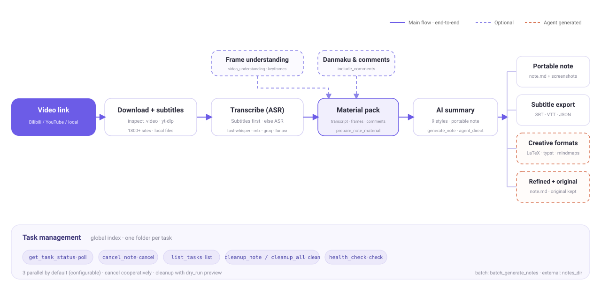
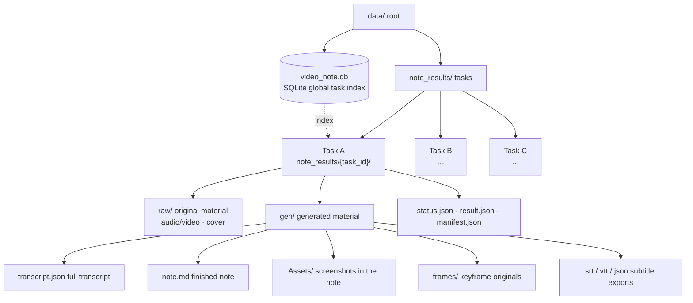

<p align="center"></p>
<h1 align="center">VideoNote-Mcp</h1>
<p align="center"><em>Video link → multi-format notes</em><br/>One link → one note · end-to-end or decoupled, any combination</p>
<p align="center"><a href="./README.md">中文</a> | <strong>English</strong></p>
<p align="center">
  <a href="#quick-start">Quick Start</a> •
  <a href="#docs">Docs</a> •
  <a href="#real-world-examples">Real-world Examples</a> •
  <a href="#pipeline-map">Pipeline Map</a> •
  <a href="#task-management">Task Management</a> •
  <a href="#best-practices">Best Practices</a> •
  <a href="#how-to-contribute">Contribute</a>
</p>

---

VideoNote-Mcp packages the whole "video link → multi-format notes" pipeline into an **MCP Server + Claude Code Skill**: hand an agent a link and it automatically runs download → transcription → frame understanding → danmaku/comments → AI summary, returning a portable note with screenshots that you can move around.

Repository: [HuangYincan/VideoNote-MCP](https://github.com/HuangYincan/VideoNote-MCP).

It works **end-to-end (one link → one note)** and is **also decoupled**: pick and choose among generation, material, task and media-processing tools. No backend required.

<p align="center">
  <a href="https://github.com/HuangYincan/VideoNote-MCP"></a>
  <a href="LICENSE"></a>
  <a></a>
  <a></a>
  <a></a>
  <a href="https://glama.ai/mcp/servers/HuangYincan/VideoNote-MCP"></a>
</p>

---

## Quick Start

```bash
# 1) One command installs both Skill + MCP (plugin marketplace, uvx auto-updates)
claude plugin marketplace add HuangYincan/VideoNote-MCP
claude plugin install videonote@videonote

# 2) Claude Code prompts for defaults during install (style / transcriber /
#    video-understanding / comments etc.); then run the guided config command:
/videonote-setup

# 3) (Optional) LLM key / Bilibili QR login / CLI wizard:
# ! videonote setup

# 4) Restart your session, tell the agent "make notes for this video" + link
```

> All four install methods, configuration details, updating and security are in [docs/04-使用手册.md](docs/04-使用手册.md).

## Docs

Full installation / configuration / usage / env vars / updating / security docs now live in `docs/` (this README keeps just the overview):

- [Document Index](docs/00-文档索引.md)
- [Architecture](docs/02-架构设计.md)
- [User Manual](docs/04-使用手册.md) — install (4 methods) · config (setup wizard + CLI) · env vars · updating · security
- [Changelog](docs/CHANGELOG.md)

---

## Real-world Examples

Two end-to-end examples: one runs **AGENT direct generation** and outputs a **LaTeX mathnote PDF**; the other runs **fully automatic LLM generation** and produces portable Markdown.

### Example 1 · agent_direct + LaTeX mathnote (DeepSeek-V4 video)

> Source: [【闪客】深入解读 DeepSeek V1~V4！男女老少都听得懂～](https://www.bilibili.com/video/BV1rpovBCEGH/?vd_source=2a93b97e35c51587de18c73fcf753191)

One video + four kinds of external sources (paper / tech report / WeChat announcement / open-source collections) → **AGENT direct generation** of a refined note, output as a **LaTeX mathnote PDF** (Chinese KaiTi template):

| Page1 | Page2 | Page3 |
| :---: | :---: | :---: |
|  |  |  |

- No LLM key: the Agent writes the note from transcript + frames + comments
- Multi-source cross-integration: video × paper × tech report × open-source list
- Refined copy keeps the original: `note.md` / `note_original.md` pair
- LaTeX mathnote PDF: auto-fixes missing fonts / line-overflow / citation dedup

Full run record: [`examples/agent-direct-deepseek-v4-mathnote/README.md`](examples/agent-direct-deepseek-v4-mathnote/README.md).

### Example 2 · Fully automatic LLM generation + portable Markdown (multi-video parallel)

A minimal prompt (3 Bilibili links + an output dir, not a single parameter given) → **fully automatic** run of env check → link detection → provider/model discovery → parameter confirmation → multi-video parallel → post-generation refinement from the transcript, producing 3 **portable refined notes** (`note.md` + `Assets/` screenshots + a "Viewer Opinions" section, keeping `note_original.md` for comparison).

- [**IELTS**](https://www.bilibili.com/video/BV1c54y187SH/): myth-busting + listening/reading/writing/speaking breakdown + 179 high-frequency exam words + 15-sentence logic framework
- [**Forensics**](https://www.bilibili.com/video/BV1QEgZ6rEGj/): a 43-year forensic pathologist "reacts" to film vs. reality; refined into 12 sections
- [**Transformer**](https://www.bilibili.com/video/BV1r8nMz4EAj/): self-attention deep dive, 18 screenshots distributed along the lecture timeline

Full run record: [`examples/note-generation-example/README.md`](examples/note-generation-example/README.md).

---

## Pipeline Map



Solid lines are the main flow: one `generate_note` link runs the whole pipeline end-to-end. Dashed lines are optional capabilities (video understanding / danmaku + comments / Agent-generated) you can opt into. Stage details (platform support, engines, parameters) live in [docs/02-架构设计.md](docs/02-架构设计.md).

## Task Management

One folder per task `note_results/{task_id}/`: `raw/` (downloaded media) + `gen/` (transcript/note/frames/exports) + control files; a **global task index** lives in the SQLite `video_tasks` table (with semantic titles). `list_tasks` enumerates all tasks (identify by semantic title), `cleanup(task_id, dry_run=True)` inspects a task before cleanup, `cleanup` does per-task / global cleanup (config & models kept by default), and `health_check` verifies FFmpeg / database / whisper readiness.



| Tool | Description | Type |
|------|------|------|
| `list_tasks` | List all tasks (global index, with semantic titles) | MCP tool |
| `cleanup` | Per-task cleanup (with `task_id`) / global cleanup (factory reset, without) | MCP tool |
| `health_check` | FFmpeg / database / whisper readiness | MCP tool |

---

## Best Practices

- **Study & exam prep**: end-to-end + video understanding + transcript-based follow-up refinement.
- **Meeting minutes**: `process_media(action="merge")` to join recorded segments → `process_media(action="diarize")` for speakers → `meeting_minutes` style.
- **Deep-reading a lecture**: after end-to-end generation, the agent refines from the full transcript, filling in section by section.
- **Video appreciation**: enable danmaku + comment integration for an "Audience viewpoints" section.
- **End-to-end vs decoupled**: use `generate_note` for a single link; use `prepare_note_material` for material-only and `process_media` for media operations (merge / diarize / export) when you only want part of the pipeline.
- **Real example**: full run records for both cases live in [`examples`](examples).

## How to Contribute

- Feature branch → PR → `dev` (CI smoke test must pass); once `dev` is stable, PR → `main` (protected branch, needs review).
- Workflow, branch naming and pre-commit self-checks are in [CONTRIBUTING.md](CONTRIBUTING.md).

## Acknowledgements

Thanks to the community and all contributors, to [Glama](https://glama.ai) for listing this MCP server, and to all open-source dependencies and the upstream pipeline project that inspired this work.
